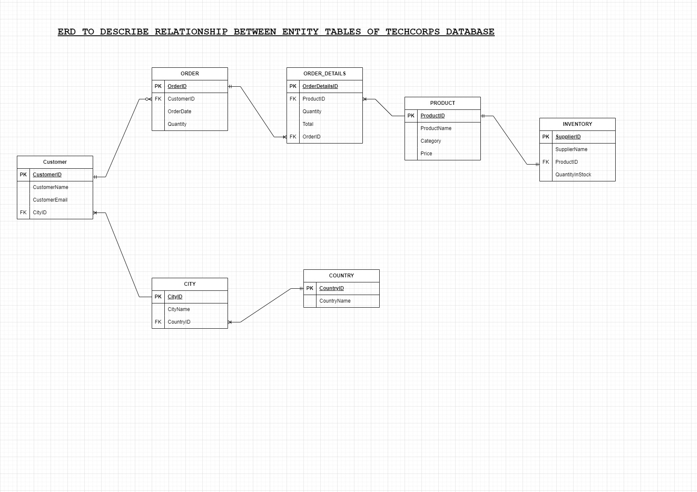
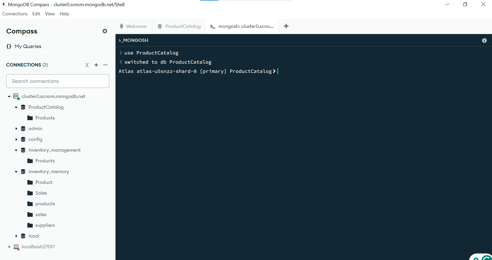
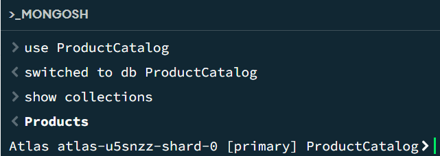
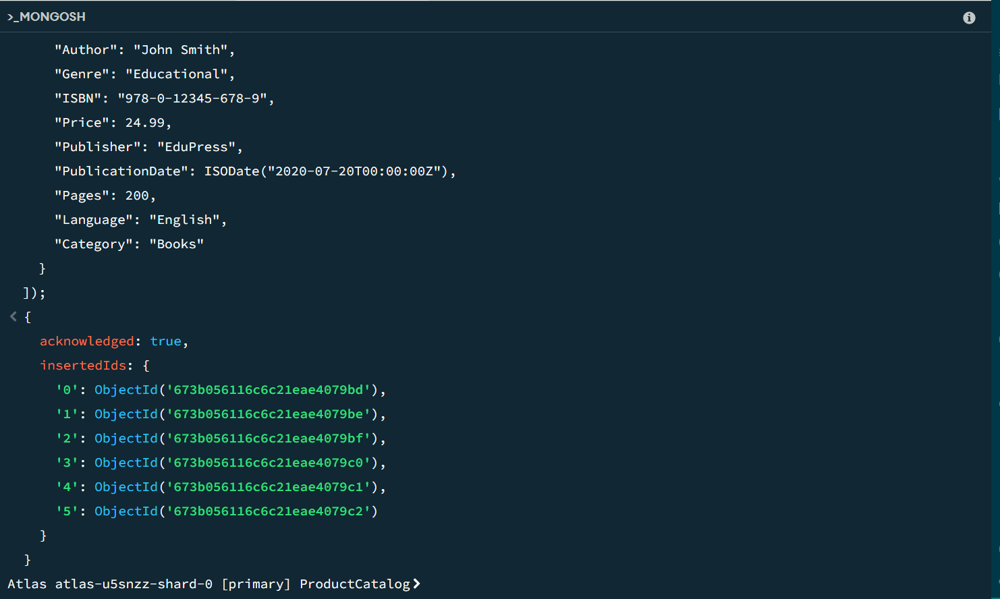
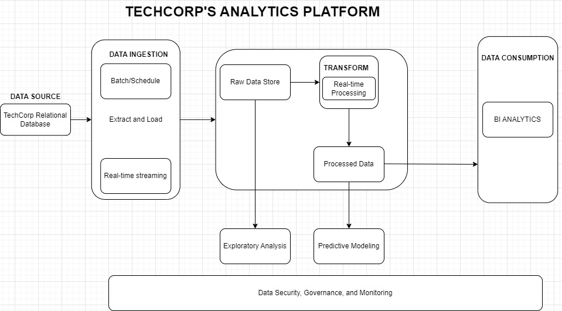

# TechCorp



# PART 1
### Explanation of Design Choices for Primary and Foreign Keys in Normalized Tables
After normalizing the initial table, it was broken down into seven tables:
1. **Customer Table**
2. **Products Table**
3. **Orders Table**
4. **Inventory Table**
5. **Order Details Table**
6. **City Table**
7. **Country Table**

#### **Customer Table**
The **Customer** table stores data about customers and initially had four attributes:
- `customer_id`: A primary key introduced to uniquely identify each customer.
- `customer_name`
- `customer_email`
- `customer_address`
The `customer_address` field contained two components: **city** and **country**, which violated the 1st Normal Form. To resolve this, the address was divided into two separate tables: **City Table** and **Country Table**, and the `customer_address` field in the **Customer Table** was replaced with a reference to the **City Table**.
After normalization, the **Customer Table** had the following attributes:
- `customer_id`: Primary key for unique customer identification.
- `customer_name`
- `customer_email`
- `city_id`: A foreign key referencing the **City Table**.
#### **City Table**
The **City Table** stores information about cities and their associated countries. Its attributes are:
- `city_id`: Primary key for unique city identification.
- `city_name`
- `country_id`: A foreign key referencing the **Country Table**.
#### **Country Table**
The **Country Table** stores details about countries and has the following attributes:
- `country_id`: Primary key for unique country identification.
- `country_name`
#### **Products Table**
The **Products Table** stores information about products, with the following attributes:
- `product_id`: Primary key for unique product identification.
- `product_name`
- `price`
- `category`
#### **Orders Table**
The **Orders Table** stores details of orders placed by customers. Its attributes are:
- `order_id`: Primary key for unique order identification.
- `order_date`
- `customer_id`: A foreign key referencing the customer who placed the order.
#### **Inventory Table**
The **Inventory Table** stores information about products, their stock levels, and suppliers. It has the following attributes:
- `supplier_id`: Primary key for unique supplier identification.
- `supplier_name`
- `stock_quantity`
- `product_id`: A foreign key referencing the **Products Table**.
#### **Order Details Table**
The **Order Details Table** captures the details of products within an order. Its attributes are:
- `order_details_id`: Primary key for unique identification of a specific product in an order.
- `order_id`: A foreign key referencing the **Orders Table**.
- `quantity`
- `product_id`: A foreign key referencing the **Products Table**.
- `total`
#### Finalized Table Structure
After normalization, the complete set of tables includes:
1. **Customer Table**
2. **City Table**
3. **Country Table**
4. **Products Table**
5. **Orders Table**
6. **Inventory Table**
7. **Order Details Table**
This design ensures proper normalization and avoids redundancy, maintaining referential integrity between the tables.

# PART 2
This implementation ensures effective transaction management following ACID properties, ensuring accurate and dependable stock management for TechCorp's online store.
```sql
DELIMITER $$

CREATE PROCEDURE PlaceOrder()
BEGIN
    DECLARE CONTINUE HANDLER FOR SQLEXCEPTION
        ROLLBACK; 

    START TRANSACTION;

    -- customer with id 2 places an order. We record the order in the order table
    INSERT INTO orders(order_date, customer_id)
    VALUES(CURDATE(), 2);

    SET @order_id = LAST_INSERT_ID();

    -- first product details
    SET @1st_product_id = 1;
    SET @1st_product_quantity = 2;

    -- second product details
    SET @2nd_product_id = 3;
    SET @2nd_product_quantity = 5;

    -- add individual items in the order to the order details table and reduce the stock quantity in the inventory table
    -- 1st product
    INSERT INTO order_details(order_id, product_id, quantity, total)
    VALUES(@order_id, @1st_product_id, @1st_product_quantity, @1st_product_quantity * (SELECT price FROM product WHERE product_id = @1st_product_id));

    UPDATE inventory
    SET stock_quantity = stock_quantity - @1st_product_quantity
    WHERE product_id = @1st_product_id;

    -- 2nd product
    INSERT INTO order_details(order_id, product_id, quantity, total)
    VALUES(@order_id, @2nd_product_id, @2nd_product_quantity, @2nd_product_quantity * (SELECT price FROM product WHERE product_id = @2nd_product_id));

    UPDATE inventory
    SET stock_quantity = stock_quantity - @2nd_product_quantity
    WHERE product_id = @2nd_product_id;

    -- commit the transaction
    COMMIT;

END$$

DELIMITER ;

CALL PlaceOrder();
```


# PART 3

TechCorp’s online store has only 10 units of the "TechCorp Smart Speaker" left in stock. Two customers, Alex and Taylor, simultaneously place orders for 5 units each. Without proper concurrency controls, both transactions could succeed, resulting in a negative stock balance.

## Potential Issues
Lost Update: Both transactions succeed without considering the other, resulting in stock levels falling below zero.
Dirty Read: One transaction reads data that has been modified but not committed by another transaction, causing incorrect or inconsistent results.
A row-level lock ensures that only one transaction can modify a specific row in the database at a time.
```sql
 -- Alex Transaction
 -- Transaction 1
 -- Begin the transaction
BEGIN;
-- Place a row-level lock on ProductID 101
SELECT * FROM TechCorp.products WHERE product_id = 101 FOR update;
-- DECREASE stock quantity by 5
update TechCorp.products SET stock_quantity = stock_quantity - 5 WHERE product_id = 101;
-- Commit the transaction
COMMIT;

-- Taylors Transaction
-- Transaction 2
-- Begin the transaction
BEGIN;
-- wait for the lock to release and then place a row-level lock on ProductID 101
SELECT * FROM TechCorp.products WHERE product_id = 101 For Update;
-- Verify stock and decrese it by 5
Update TechCorp.products SET stock_quantity = stock_quantity - 5 where product_id = 101;
-- Commit the transaction
COMMIT;
```


# PART 4
Creating a database named ProductCatalog,



A collection named Product



Mongo queries to insert data into the collection.
To insert a single document to the collection, use the insert_one() method.
   ### FOR ELECTRONICS;
   ### For Electronics

```javascript
db.products.insertOne({
  "ProductID": "E123456",
  "Name": "Smartphone X10",
  "Brand": "TechNova",
  "Price": 599.99,
  "Specifications": {
    "Display": "6.5 inches AMOLED",
    "Processor": "Snapdragon 888",
    "Battery": "4000mAh",
    "Camera": {
      "Rear": "64MP",
      "Front": "20MP"
    },
    "Storage": "128GB",
    "RAM": "8GB"
  },
  "Warranty": "2 years",
  "ReleaseDate": ISODate("2023-05-01T00:00:00Z"),
  "Category": "Electronics"
});
````

  ### FOR CLOTHING;
   ```javascript
    db.products.insertOne({
  "ProductID": "C987654",
  "Name": "Men's T-Shirt",
  "Size": "L",
  "Color": "Blue",
  "Material": "Cotton",
  "Price": 19.99,
  "Brand": "FashionCo",
  "StockQuantity": 150,
  "Category": "Clothing",
  "Gender": "Male"
});
```
### FOR BOOK;
```javascript
    db.products.insertOne({
  "ProductID": "B543210",
  "Title": "The Great Adventure",
  "Author": "Jane Doe",
  "Genre": "Adventure Fiction",
  "ISBN": "978-1-23456-789-0",
  "Price": 15.99,
  "Publisher": "Adventure Books Inc.",
  "PublicationDate": ISODate("2021-03-15T00:00:00Z"),
  "Pages": 350,
  "Language": "English",
  "Category": "Books"
});
```

To insert multiple documents to the collection, use the insert_many() method.
```javascript
db.products.insertMany([
  // Electronics products
  {
    "ProductID": "E123456",
    "Name": "Smartphone X10",
    "Brand": "TechNova",
    "Price": 599.99,
    "Specifications": {
      "Display": "6.5 inches AMOLED",
      "Processor": "Snapdragon 888",
      "Battery": "4000mAh",
      "Camera": {
        "Rear": "64MP",
        "Front": "20MP"
      },
      "Storage": "128GB",
      "RAM": "8GB"
    },
    "Warranty": "2 years",
    "ReleaseDate": ISODate("2023-05-01T00:00:00Z"),
    "Category": "Electronics"
  },
  {
    "ProductID": "E234567",
    "Name": "Laptop Pro 15",
    "Brand": "CompTech",
    "Price": 1299.99,
    "Specifications": {
      "Display": "15.6 inches Retina",
      "Processor": "Intel i7-10750H",
      "Battery": "5500mAh",
      "Camera": {
        "Rear": "No camera",
        "Front": "720p"
      },
      "Storage": "512GB SSD",
      "RAM": "16GB"
    },
    "Warranty": "1 year",
    "ReleaseDate": ISODate("2022-08-10T00:00:00Z"),
    "Category": "Electronics"
  },

  // Clothing products
  {
    "ProductID": "C987654",
    "Name": "Men's T-Shirt",
    "Size": "L",
    "Color": "Blue",
    "Material": "Cotton",
    "Price": 19.99,
    "Brand": "FashionCo",
    "StockQuantity": 150,
    "Category": "Clothing",
    "Gender": "Male"
  },
  {
    "ProductID": "C765432",
    "Name": "Women's Jeans",
    "Size": "M",
    "Color": "Black",
    "Material": "Denim",
    "Price": 49.99,
    "Brand": "StyleWear",
    "StockQuantity": 200,
    "Category": "Clothing",
    "Gender": "Female"
  },

  // Book products
  {
    "ProductID": "B543210",
    "Title": "The Great Adventure",
    "Author": "Jane Doe",
    "Genre": "Adventure Fiction",
    "ISBN": "978-1-23456-789-0",
    "Price": 15.99,
    "Publisher": "Adventure Books Inc.",
    "PublicationDate": ISODate("2021-03-15T00:00:00Z"),
    "Pages": 350,
    "Language": "English",
    "Category": "Books"
  },
  {
    "ProductID": "B123456",
    "Title": "Science 101",
    "Author": "John Smith",
    "Genre": "Educational",
    "ISBN": "978-0-12345-678-9",
    "Price": 24.99,
    "Publisher": "EduPress",
    "PublicationDate": ISODate("2020-07-20T00:00:00Z"),
    "Pages": 200,
    "Language": "English",
    "Category": "Books"
  }
]);
````




# PART 5


For TechCorp, the data lake serves as a central location where all kinds of data (e.g., products, customers, orders, inventory) from various sources can be ingested, stored, processed, and analyzed. The data lake allows the company to efficiently move away from the current unorganized table, which causes redundancy and performance issues, and transition to a more modern, scalable system.

## Data Ingestion (Batch/Scheduled & Real-Time Streaming):

Batch/Scheduled Ingestion: TechCorp can periodically (e.g., daily, weekly) ingest large batches of data from their legacy systems (such as the old database) into the data lake. This could include structured data like sales orders, customer profiles, or inventory updates. The data is typically stored in raw format, which means it hasn't been cleaned, transformed, or processed yet.

Real-Time Streaming: For real-time operations like customer orders, product inventory updates, or website interactions, TechCorp can stream data into the data lake in near real-time. This allows TechCorp to continuously capture and store live data as it flows from different sources.

## Raw Data Store to EDA (Exploratory Data Analysis):

The raw data stored in the data lake can then be accessed for Exploratory Data Analysis (EDA). EDA involves analyzing the raw, unprocessed data to discover trends, patterns, relationships, and potential issues.
TechCorp can use data wrangling and ETL (Extract, Transform, Load) processes to clean and preprocess the raw data from the data lake before performing EDA.
The data might be analyzed using visualization tools (Power BI) or statistical techniques. This stage helps identify any data quality issues, redundancies, and also allows TechCorp to gain insights into the structure and meaning of the data.


## Real-Time Processing to Processed Data:

As part of the real-time data processing, raw data from the data lake can be continuously processed, cleaned, and transformed into a more structured and usable format. This is crucial for TechCorp, especially in scenarios where the company requires up-to-the-minute insights, such as inventory updates or real-time product availability.
Tools like Apache Spark, Flink, or cloud-based solutions (e.g., AWS Glue, Azure Data Factory) can be used to process this data efficiently, transforming it into a more usable form for analysis and downstream applications (like predictive modeling or BI analytics).
The processed data is then stored in a more structured format, such as in a data warehouse or structured storage layer (still within the broader data lake ecosystem), making it easier to work with for more advanced analytics.

## From Processed Data to Predictive Modeling:

Once the data is processed, TechCorp can leverage predictive modeling techniques to analyze trends, forecast demand, or predict customer behavior. This could involve machine learning algorithms (like regression models, classification models, or time series forecasting) to generate insights that are valuable for decision-making.
The processed data in the data lake can be fed into machine learning pipelines, enabling predictions about future product sales, inventory needs, customer churn, and more. Tools like TensorFlow, Scikit-learn, or cloud-based services can help build these predictive models.
The results of these models can be stored back in the data lake or a separate database for further analysis or integration into other business processes.
From Processed Data to BI Analytics:

**Finally**, TechCorp can use the processed data from the data lake to fuel Business Intelligence (BI) Analytics. BI tools (e.g., Power BI, Tableau, Looker) can connect directly to the data lake or the data warehouse layer, enabling decision-makers to access real-time dashboards, reports, and visualizations that help track business KPIs, product performance, sales trends, and more.
BI analytics will provide insights that support decision-making at various levels of the organization, from operational managers to executives, by offering a clear, visual understanding of key metrics and business trends.
